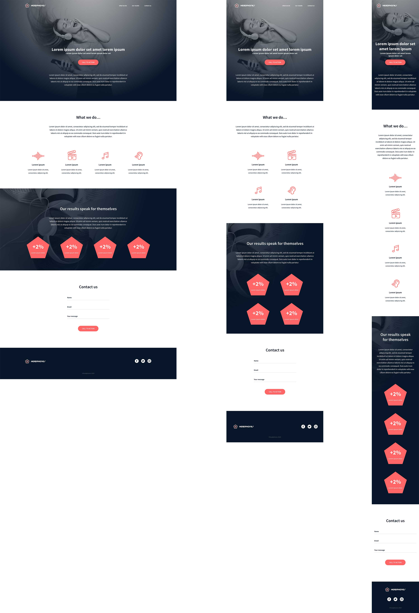

#  Holberton School - Headphones Landing Page

This project is part of the Holberton School curriculum. The goal is to **build a landing page from scratch** using HTML and CSS, based on a Figma design.

## 🎯 Project Objective

- Accurately reproduce a provided Figma mockup.
- Structure a web page using semantic HTML5.
- Style the page using modern CSS practices.
- Understand the basics of web layout and responsive design.

## 🖼️ Design Preview

The layout is based on the following Figma design:



---

## 🧱 Project Structure

The landing page is divided into the following sections:

1. **Header**
   - Site logo
   - Navigation menu
   - Call-to-action button

2. **"What we do..." Section**
   - Overview of services or features
   - Visual elements and descriptions

3. **"Our results" Section**
   - Visual statistics and performance indicators

4. **Contact Us Section**
   - Contact form
   - Contact information

5. **Footer**
   - Social media links
   - Legal mentions
   - Additional links or information

---

## 🛠️ Technologies Used

- HTML5
- CSS3
- [Figma](https://www.figma.com/) (for the design mockup)

---

## 🚀 Getting Started

To run the project locally:

1. Clone the repository:
   ```git clone https://github.com/<your-username>/holbertonschool-headphones.git```